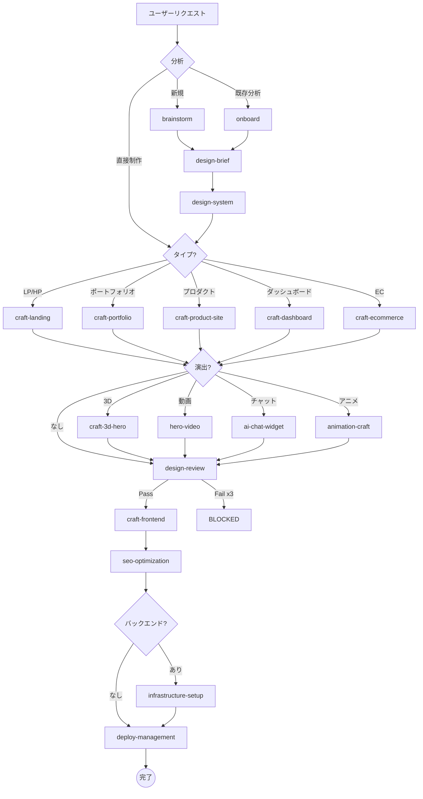

# Design Workflow — 自動ルーティング

> ユーザーのリクエストを分析し、最適なデザインスキルに自動ルーティングする。

## 常時起動

このスキルは常に暗黙的に動作。ルーティングテーブルは `WORKFLOW.md` → Automatic Skill Routing を参照。

## 複合リクエストの分解

```text
例: 「動画ヒーローのあるSaaS向けLPを作りたい。AIチャットも付けて。」

分解:
  1. design-brainstorm → デザイン方向性決定
  2. design-brief → ブリーフ作成
  3. design-system → デザインシステム構築
  4. craft-landing → LP設計・実装
  5. hero-video / ai-chat-widget → 追加演出
  6. design-review → 品質監査
  7. craft-frontend → コンポーネント実装
  8. seo-optimization → SEO/OGP
  9. deploy-management → デプロイ
```

## 推奨フロー



## 判断に迷った場合

- 「design-brainstorm から始めましょう」が最も安全
